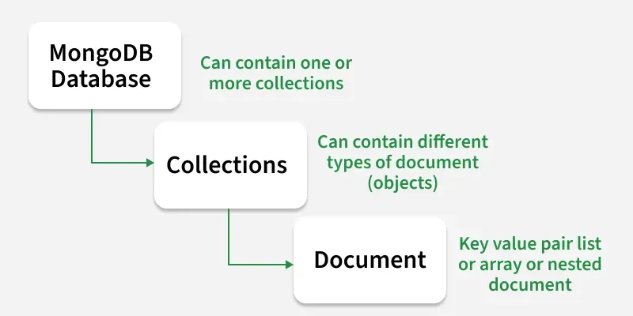

# MongoDB

## What is MongoDB?
MongoDB is an **open-source**, **document-oriented**, **nosql** database management system.
MongoDB is case-sensitive.


## What is a Document Database?
* A document database (also known as **document oriented database** or a **document store**) is a database that stores information in documents.

* MongoDB is designed for **flexibility**, **scalability**, and **performance** in handling ***unstructured*** and ***semi-structured*** data.


## SQL and NoSQL:

### SQL:
* SQL database are **relational databases**.
* They are structured tables to store data in **rows** and **columns**.
* Suitable for applications with well-defined schemas and fixed data structures.
* E-Commerce plaform, HR Management, etc.
* ***Example***: MySQL, PostgreSQLm, Oracle.

### NoSQL:
* NoSQL database are **non-relational databases**.
* They provide **flexibility in data storage**, allowing **varied data types** and **structures**.
* Ideal for applications with dynamic or evolving data models.
* Used for - **CMS**, **Social media platforms**, **Gaming**, etc.
* ***Example***: **MongoDB**, **Cassandra**, etc.

### Example:
```json
[
    {
        "_id": "1",
        "full_name": {
            "first_name": "Arbaz",
            "last_name": "Khan"
        },
        "age":"22",
        "grade":"12",
        "subjects": [
            {"subject_name": "Mathematics", "marks": 92},
            {"subject_name": "Computer", "marks": 100}
        ]
    }
]
```

> MongoDB Structure: <br/>



## Features of MongoDB:
* **Flexible Schema Design**: 
    * MongoDB allows *dynamic*, *schema-less* data sturectures.
    * Easily accommodate changing data requirements.

* **Scalability and Performance**:
    * ***Horizontal scaling*** *supports large datasets* and *high traffic*.
    * **Optimized read** and **write** operations for *fast performance*.

* **Document-Oriented Storage**:
    * Data is stored in flexible, **JSON-like BSON documents**.
    * Self contained units with **rich data types** and **nasted arrays**.

* **Dynamic Queries**:
    * **Rich query languages** with **support for complex queries**.
    * Utilize indexes to speed-up queries execution.

* **Aggregration Framework**:
    * Perform **advanced data transformations** and **analysis**.
    * **Process data using multiple pipelines stages**.

* **Open-Source Community**:
    * MongoDB is a **open-source** with a **large comunity support**
    * **Regular updates**, **imporvement** and **support**.


## JSON vs BSON:
* In MongoDB, **we write data in JSON**, but internally, it is **stored in BSON** (Binary JSON).

* BSON allows: <br/>
✔️ Faster read & write operations <br/>
✔️ Reduced storage usage <br/>
✔️ Better handling of complex data structures <br/>

### JSON:
```json
{
  "name": "Arbaz",
  "age": 22,
  "isStudent": true,
  "scores": [88, 95],
  "address": {
    "city": "Delhi"
  }
}
```

### BSON:
```bson
\x31\x00\x00\x00
\x02name\x00\x06\x00\x00\x00Arbaz\x00
\x10age\x00\x17\x00\x00\x00
\x08isStudent\x00\x01
\x04scores\x00\x15\x00\x00\x00
\x10\x00\x58\x00\x00\x00
\x10\x01\x5F\x00\x00\x00
\x00
\x03address\x00\x13\x00\x00\x00
\x02city\x00\x06\x00\x00\x00Delhi\x00
\x00
\x00
```


## Required files and Softwares:
1. MongoDB Community Server: [Download](https://www.mongodb.com/try/download/community)
2. MongoDB Shell: [Download](https://www.mongodb.com/try/download/shell)
3. MongoDB Database Tools: [Download](https://www.mongodb.com/try/download/database-tools)


## Some Basic MongoDB Commands:

### 1. Check Version:
```bash
mongod --version
```

---

### 2. Starting MongoDB Server:
```bash
mongosh
```

---

### 3. Showing Databases:
```bash
show dbs
# OR
show databases
```

---

### 4. Creating Database:
```bash
use <database_name>
```

---

### 5. Deleting Database:
```bash
db.dropDatabase()
```

---

### 6. Showing Collections:
```bash
show collections
```

---

### 7. Creating Collection:
```bash
db.createCollection('<collection_name>')
```

---

### 8. Deleting Collection:
```bash
db.<collection_name>.drop()
```

---

### 9. Showing Documents:
```bash
db.<collection_name>.find()
```

---

## Insert Documents:

### Inserting Document (Single):
```js
db.<collection_name>.insertOne({
    "field1":"value1",
    "field2":"value2"
});
```

### Inserting Document (Multiple):
```js
db.<collection_name>.insertMany([
    {"field1":"value1", "filed2": "value2", ...},
    {"field1":"value1", "filed2": "value2", ...}
])
```


## Read Operations:
1. **find()**:

Syntax:
```js
db.<collection_name>.find({key: value});
```

2. **findOne()**:

Syntax:
```js
db.<collection_name>.findOne({key: value});
```

## When to use Quotes and when not?
* **Special Characters**:
If a field name *contains special characters* or *spaces*, or *starts with a numeric digit*, using ***quotes is necessory***.

* **Reserve Words**:
If a field name is a reserved keyword in MongoDB, use quotes distinguish it from the reserved keyword.

### Examples:
```js
db.students.insertOne({
  "1name": "Arbaz",     // starts with a number
  "full name": "Khan",  // contains space
  "e-mail": "arbaz@example.com" // contains special character (-)
  "type": "Admin",   // reserved keyword
  "key": "12345",    // reserved keyword
  "db": "collegeDB"  // reserved keyword
})
```


## Orderd and Unordered Inserts:
When executing bulk write operations, **ordered** and **Unordered** determine the batch behaviour.
* **Ordered Inserts**:
    * Default behavior is ordered, where MongoDB **stops on the first error**.
    * **db.<collection_name>.insertMany([doc1, doc2, ...]);**

* **Unordered Inserts**:
    * When executing bulk write operations with unordered flag, MongoDB ***processing after encountering an error***.
    * **db.<collection_name>.insertMany([doc1, doc2, ...], {ordered: false});**

### Examples:

#### Default Behaviour (*ordered: true*):
If one insert fails, MongoDB stops inserting the rest.

```js
db.students.insertMany(
  [
    { _id: 1, name: "Arbaz" },
    { _id: 1, name: "Duplicate ID" } // ❌ duplicate _id (error)
    { _id: 2, name: "Salman" },
  ]
)
// Only first will inserted, second fails → stops further execution.
```

#### With (*ordered: false*):
If one insert fails, MongoDB continues inserting the rest.

```js
db.students.insertMany(
  [
    { _id: 3, name: "Ali" },
    { _id: 3, name: "Duplicate ID" }, // ❌ duplicate error
    { _id: 4, name: "Khan" }
  ],
  { ordered: false }
)
// Ali ✅ inserted
// Duplicate ❌ skipped
// Khan ✅ still inserted
```


## Importing JSON in MongoDB:

If json is ***not in array***:
```js
mongoimport <json_file_name.json> -d <database_name> -c <collection_name>;
```

If json is ***array of object***:
```js
mongoimport <json_file_name.json> -d <database_name> -c <collection_name> --jsonArray;
```

NOTE: *--jsonArray* accepts the import of data expressed with multiple MongoDB documents within a single JSON array.


## Operators:

### Comparison Operators:
$eq => Equal to
$neq => Not equal to
$gt => Greater then
$gte => Greater then equal to
$lt => Less then
$lte => Less then equal to
$in => In
$nin => Not in


```js
db.<collection_name>.find({'fieldName': {$<operator>: <value>}});
```

Eample:
```js
db.products.find({'price': {$gte: 200}});
```

Example of In Operator:
```js
//in (In) Operator
//it will gives only given values data
db.products.find({'price': {$in: [200, 245, 399]}});

//nin (Not In) operator
//it will gives data excepts given values
db.products.find({'price': {$nin: [200, 245, 399]}});
```

## Introduction to Cursors:

### Cursors:

* Cursors in MongoDB are used to retrieve large result sets from queries efficiently, providing control over the data retrieval process.

* MongoDB retrieves query results in batches using cursors.

* Cursors are pointer to the result set on the server.

* Cursors are used to iterate through query results.

### Automatic Batching:

* MongoDB retrieves query results in batches, not the entire result set at once.

* The default batch size for the initial query is 101 documents (or fewer if the result set has less).

* For subsequent batches, the default is 16 MB of data per batch (not a fixed number of documents).

* This improves memory efficiency and network usage.

## Cursor Methods:

* count(): counts number of documents. 

* limit(): 

* skip():

* sort(): 

### Examples:
```js
//count
db.products.find({'price': {$lt: 300}}).count();

//limit
db.products.find({'price': {$lt: 300}}).limit(5);

//skip
db.products.find({'price': {$lt: 300}}).limit(5).skip(2);

//limit 
// 1 for ascending and -1 for descending
db.products.find({'price': {$lt: 300}}).limit(5).sort({'price': 1});
```

## Logical Operators:

* $and : 
  * true and true => true
  * true and false => false
  * false and true => false
  * false and false => false

* $or : 
  * true or true => true
  * true or false => true
  * false or true => true
  * false or false => false

* $not : 
  * false => true
  * true => false

* $nor (***not*** and ***or***) : 
  * true nor true => false
  * true nor false => false
  * true nor false => false
  * false nor false => true


### Example:
```js
//and
db.products.find({$and: [{'price': {$gt: 4000}}, {'ratings': {$gt: 4}}]});

//or
db.products.find({$or: [{'price': {$gt: 4000}}, {'ratings': {$gt: 4}}]});

//not
db.products.find({$not: {'price': {$gt: 4000}}});

//nor
db.products.find({$nor: [{'price': {$gt: 4000}}, {'ratings': {$gt: 4}}]});
```


## Complex Expressions

* The **$expr** operator allows using aggregation expressions within a query.

* Useful when you need to compare fields from the same documents in a more complex manner.

#### Syntax:
```js
{$expr: {operator: [field, value]}}
```

#### Examples:
```js
db.products.find({$expr: {$gt: ['price', 40000]}});
```

Find sales where (Quantity * price) is greater then targetPrice:
```js
db.sales.find({$expr: [{$multiply: ['$quantity', '$price']}, '$targetPrice']});
```


## Elements Operators:

* $exists: 

* $type:

* $size: 

Syntax:
```js
//$exists
{ field: {$exists: <boolean>} }
```
```js
//$type
{ field: {$type: "<bson_data_type>"} }

//bson datatype:
1: Double
2: String
3: Object
4: Array
5: Binary data
6: Undefined
7: ObjectId
8: Boolean
9: Date
10: Null
11: Regular Expression
12: DBPointer
13: Javascript
14: Symbol
15: JavaScript with scope
16: int
17: timestamp
18: long
19: decimal
-1: minKey
127: maxKey
```
```js
//$size
{ field: {$size: [array_length]} }
```

Example:
```js
//$exists
db.products.find( { 'price': {$exists: true} } );

//$type
db.products.find( { 'price': {$type: 1} } ); // 1 is for double

//$size
db.products.find( { 'price': {$size: [1]} } );
```


## Projection:

Projection specifying which fields to include or exclude in the query results.

* To **include specific fields**, use projection with a **value of 1** for the fields you want. 

* To **exclude fields**, use projection with a **value of 0** for the fields you want to exclude.

* You ***cannot include and exclude fields simultaneously*** in the same query projection.

* The **_id field is included by default** unless ***explicitly excluded***.

Syntax:
```js
db._connection_name_.find({}, {field1: 1, field2: 1, ...});
```


## Embedded Documents:

* Query documents inside embedded documents using dot notation.

Syntax:
```js
db.<collection_name>.find({"<parent>.<chind>": <value>});
```

Example:
```js
db.products.find({"comments.user": "Arbaz"});
```

### $all vs $elemMatch

* The **$all** operator selects the documents where the value of a field is an array that contains all the specified elements.

Syntax:
```js
{<field>: {$all: [<value1>, <value2>, ...]}}
```

* The **$elemMatch** operator matches documents that contain an array field with at least one element that matches all the specified query criteria.

Syntax:
```js
{<field>: {$elemMatch: {<query1>, <query2>, ...}}}
```

Example:
```js
db.comments.find({'comments.user': {$all: ['Arbaz', 'Khan']}});
```


## Update Operations in MongoDB:

* **updateOne()** and **updateMany()**.

* **Removing** and **renaming** fields.

* **Adding**, **removing items** from ***array***.

* **Updating embedded documents**.

### 1. **updateOne()** and **$set**:

Syntax:
```js
db.<collectionName>.updateOne(
  {filter},
  {$set: {"<existingField>": newValue, "newField": newValue, ...}}
);
```

Example:
```js
//without adding new field
db.products.updateOne(
  {"_id": ObjectId('68c029c6877d92f7e7428df3')},
  {$set: {"price": 5000}}
  );

//with adding new field
db.products.updateOne(
  {"_id": ObjectId('68c029c6877d92f7e7428df3')},  //filter
  {$set: {"price": 5000, "newField": "newValue"}}  //updation
);
```

### 2. **updateMany()** and **$set**:

Syntax:
```js
db.<collectionName>.updateMany(
  {filter},
  {$set: {"<existingField>": newValue, ...}}
)
```

Example:
```js
db.products.updateMany(
  {price: {$gt: 200}, price: {$lt: 500}},  //filter
  {$set: {price: 20000}});  //updation
```


## Renaming and Renaming Fields:

### $unset

Syntax:
```js
db.<collection_name>.updateOne( 
  {<filter>},
  {$unset: {<fieldName>: 1}} 
  );
```

### $rename

Syntax:
```js
db.<collection_name>.updateOne(
  {filter},
  {$rename: {<oldFieldName>: "<newFieldName>"}}
);
```


## Updating arrays and Embedded Documents:

### $push

Syntax:
```js
db.<collection_name>.updateOne(
  {<filter>},
  {$push: {<arrayField>: "new element"}}
);
```

### $pop

Syntax:
```js
db.<collection_name>.updateOne(
  {<filter>},
  {$pop: {<arrayField>: <value>}}
);
```

### Update Values in Embedded Documents:

Syntax:
```js
db.<collection_name>.updateOne(
  {<filter>},
  {$set: {"<field_name>.$.<field_name>": "new_value"}}
);
```

Example:
```js
db.products.updateOne(
  {"product_id": 23},
  {$set: {"comments.$.text": "I am updated text"}}
);
```


## Delete Operations:

### deleteOne()

Syntax:
```js
db.<collection_name>.deleteOne({<filter>});
```

Example:
```js
db.products.deleteOne({"product_id": 23});
```

### deleteMany()

Syntax:
```js
db.<collection_name>.deleteMany({<filter>});
```

Example:
```js
db.products.deleteMany({"price": {$gt: 40000}});
```


## Indexes in MongoDB:

### What are Indexes?

Indexes are **specialized data structures** that **optimize data retrieval speed** in MongoDB.

* Indexes **stores a fraction of data in a more searchable format**.

* They enables MongoDB to **locate data faster *during queries***.

* Indexes are **separate from collections** and **multiple indexes can exist per collection**.


### Benefits of Indexes:

* **Faster Querying**: Indexes drastically ***accelerate data retrieval***, particularly ***for large collections***.

* **Efficient Sorting**: Indexes facilitates **rapid sorting** ***based on specific fields***.

* **Improved Aggregation**: Agggregation operations becomes **more efficient with optimized indexes**.

* **Indexing on Multiple Fields**: ***Complex queries*** can be ***executed efficiently*** by ***utilizing multiple fields in indexes***.


### explain()

* Use **explain()** method to understand query execution in details.

Syntax:
```js
db.<collection_name>.find( {<filter>} ).explain(); 
```

Example:
```js
//
db.products.find( {name: "Mobile"} ).explain();

//
db.products.find( {name: "Mobile"} ).explain("executionStats");
```

* Use it to **measure the time taken to execute a query**.